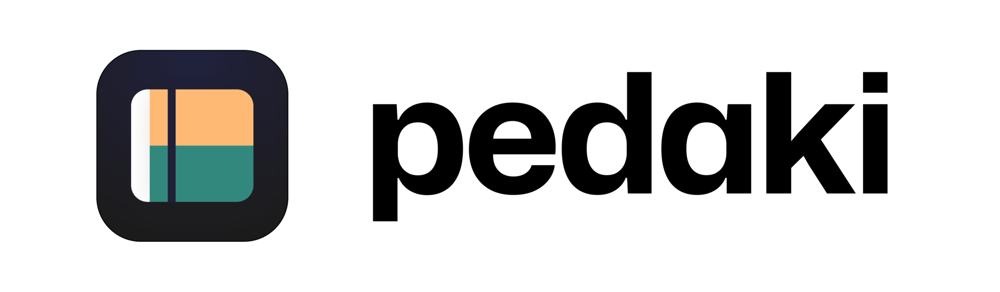

  

# Features

# Demo

# Technologies

- [Next.js](https://nextjs.org/) - Framework React
- [Tailwind CSS](https://tailwindcss.com/) - Styling
- [Prisma](https://www.prisma.io/) - ORM
- [Resend](https://resend.com/) - Email
- [NextAuth.js](https://next-auth.js.org/) - Authentication

# Contributing

Pedaki is an open source project. Feel free to contribute by opening issues and/or pull requests.
See [CONTRIBUTING.md](CONTRIBUTING.md) for more details.

Website: [https://www.pedaki.fr](https://www.pedaki.fr)
Website Repository: [https://github.com/vahor/pedaki.fr](https://github.com/vahor/pedaki.fr)